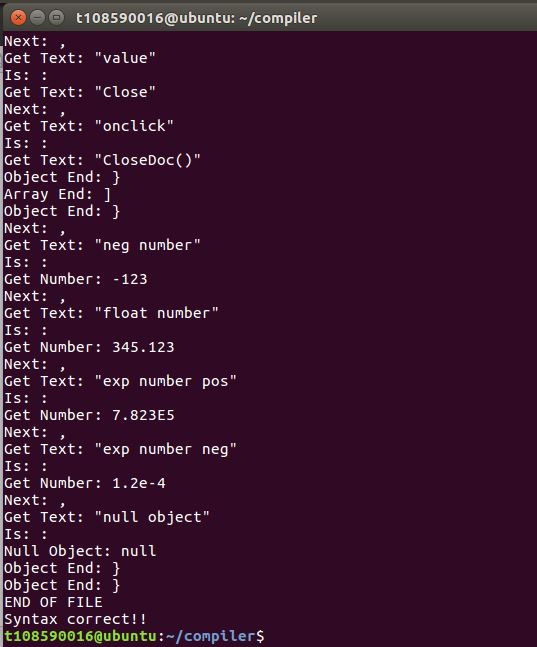
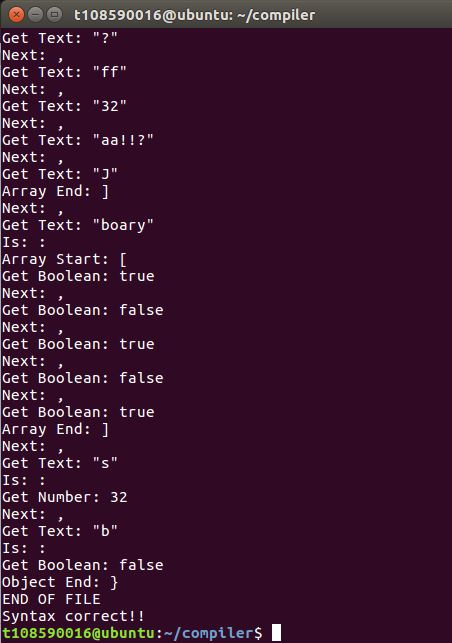
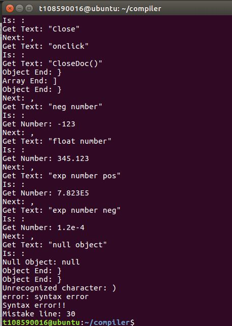
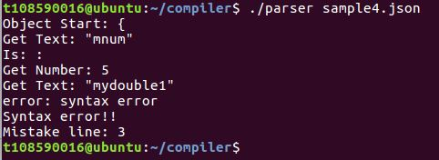

# Compiler Program Homework #2
期末報告題目為將JSON轉換為XML  
所以本次作業目標為製作JSON文件的scanner及parser

## 小組成員
108590005 何秉育 : Lexical analysis  
108590016 陳琴連 : Syntax analysis

## 執行
輸入`make`指令，使用makefile將程式進行編譯  
輸入檔案進行文法判斷：`.\scanner .\samples\sample1.json`  
hint:在samples資料夾中有4個範例檔案

## JSON格式簡介
JSON 是一種輕量級資料交換格式，由屬性和值所組成，優點是易於閱讀和處理。  
目前 JSON 使用在 JavaScript、Java、Node.js、C#應用的情況比較多。 

JSON 的基本資料類型有
- 數值
- 字串
- 布林值
- 陣列
- 物件
- 空值

### 範例
```json
{
    "firstName": "John",
    "lastName": "Smith",
    "sex": "male",
    "age": 25,
    "address": 
        {
            "streetAddress": "21 2nd Street",
            "city": "New York",
            "state": "NY",
            "postalCode": "10021"
        },
    "phoneNumber": 
        [
            {
                "type": "home",
                "number": "212 555-1234"
            },
            {
                "type": "fax",
                "number": "646 555-4567"
            }
        ]
}
```

## 執行結果
#### sample1.json

#### sample2.json

#### sample3.json

#### sample4.json
